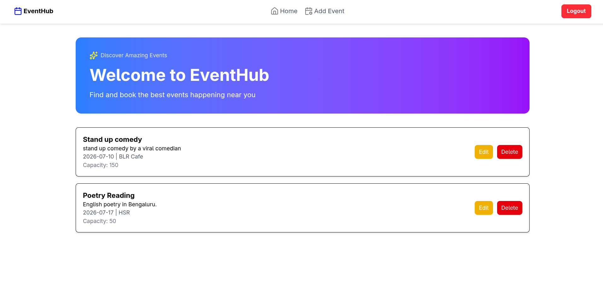
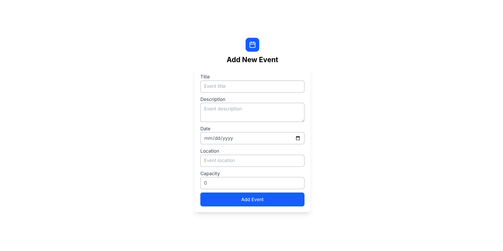
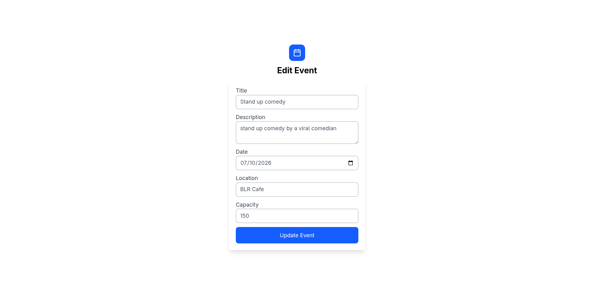
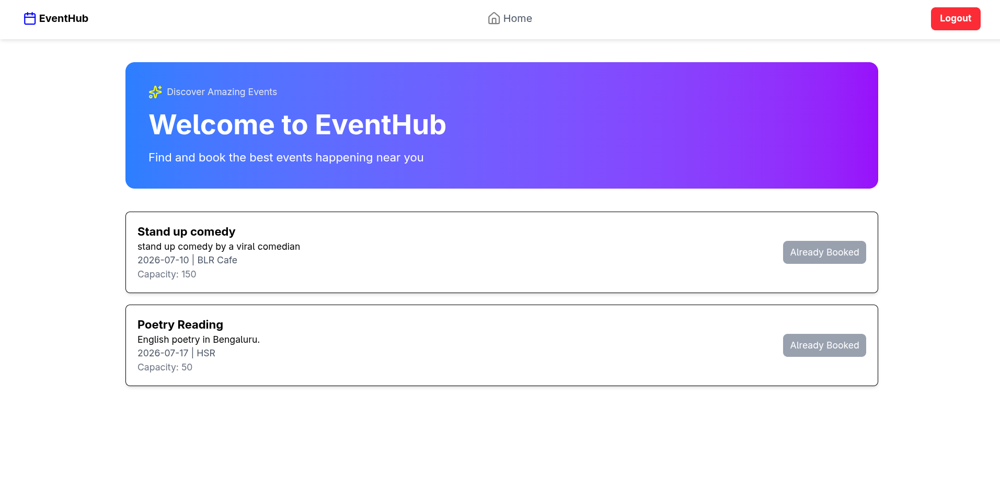

# EventHub – Event Booking Platform

EventHub is a role‑based event booking system built with **React.js + TypeScript** (frontend) and **localStorage** for persistence.  
Optional backend integration can be done with **Spring Boot** for production‑ready APIs.

---

## Features

### User
- Sign up / Login
- View events on the home page
- Personalized welcome message
- Event detail pages
- Book events (with dummy payment flow)
- My Events page (Past & Upcoming)
- Logout

### Admin
- Login
- Add new events
- Edit existing events
- Delete events
- View all events with management controls

### Middleware
- Role‑based access control using dummy JSON data
- Users see **Book** button only
- Admins see **Edit/Delete** buttons only

---

# Home Page Admin

# Add Event (admin only)

# Edit Event (admin only)

# Home Page User

